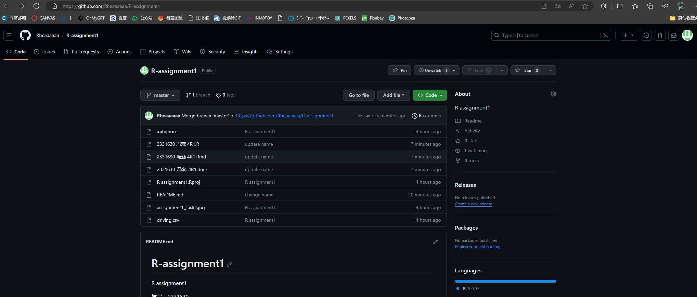
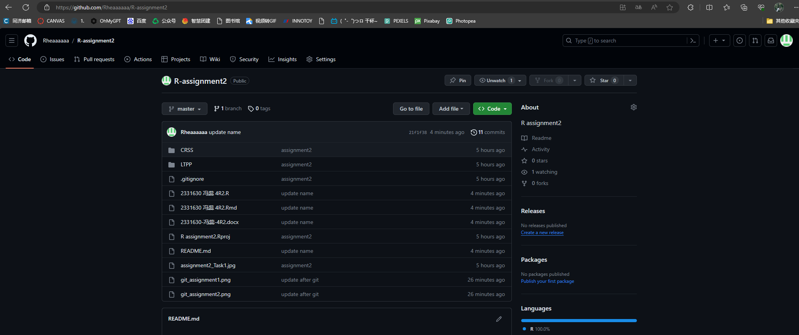

# Task1: Using the iri dateset
## 1. Get a subset with STATE_CODE 6 and SHRP_ID starting with 050.
```{r warning=FALSE,message=FALSE}
library(dplyr)

# Read csv. data
iri <- read.csv("C:\\Users\\23367\\Desktop\\R assignment2\\LTPP\\iri.csv")

# Filter the data that meets the conditions
iri_sub <- subset(iri, STATE_CODE == 6 & substr(SHRP_ID,1,3) == '050')

# Show 10 lines
iri_sub |> dim()
iri_sub |>
  slice_sample(n=10)
```

## 2. Obtain the summary statistics of IRI of each section: min, max, and mean.
```{r message=FALSE}

# Calculate the summary statistics
iri_stat <- iri |>
  group_by(STATE_CODE, SHRP_ID) |>
  summarise(
    observation = n(),
    iri_min = min(IRI),
    iri_max = max(IRI),
    iri_mean = mean(IRI)
  ) |>
  ungroup()

# Show 10 lines
iri_stat |> dim()
iri_stat |>
  slice_sample(n=10)
```

## 3. Sort the summarized data by the averaged IRI in a descending order.
```{r message=FALSE}
# Sort in a descending order
iri_sort <- iri_stat[order(iri_stat$iri_mean, decreasing = T),]

# Show 10 lines
iri_sort |> dim()
iri_sort |>
  slice_sample(n=10)
```

## 4.1. Generate a scatter plot for the averaged IRI against the time for a selected section.
```{r warning=FALSE,message=FALSE}
# Generate a subset with STATE_CODE=6 and SHRP_ID=0504
sel <- subset(iri, STATE_CODE == 6 & SHRP_ID == '0504')

# Calculate the summary statistics grouped by VISIT_DATE
sel_stat <- sel |>
  group_by(VISIT_DATE) |>
  summarise(
    iri_mean = mean(IRI)
  ) |>
  ungroup()

# Split VISIT_DATE
library(tidyr) 
sel_stat <- separate(sel_stat, VISIT_DATE, c("DATE","TIME"), sep=",") |>
  mutate(
    DATE = as.Date(DATE,"%m/%d/%y")
  )
sel_stat <- sel_stat[order(sel_stat$DATE),]

# Show
sel_stat

# Generate a scatter plot
plot(x=sel_stat$DATE,
     y=sel_stat$iri_mean, 
     col=adjustcolor("darkred", 1/2),
     xlab="time", ylab="mean IRI",
     main = "mean IRI-time Scatter Plot")
```

## 4.2. Give your interpretation of the plot.

  如图所示，STATE_CODE=6且SHRP_ID=0504的这一子类的IRI均值随时间变化趋势明显。在1990年至1992年间，IRI均值激增，年增长率15%~30%；在1993年断崖式下跌后，1993年至2006年间呈现基本增长趋势，增长幅度较缓，年增长率保持在6%以下；2007年增速显著提高，年增长19%。

# Task2: Using the CRSS datasets in 2017
## 1. Get the intersection of the datasets accident and person.
```{r}
# Read csv. data
accident <- read.csv("C:\\Users\\23367\\Desktop\\R assignment2\\CRSS\\ACCIDENT.csv")  
person <- read.csv("C:\\Users\\23367\\Desktop\\R assignment2\\CRSS\\PERSON.csv")
vehicle <- read.csv("C:\\Users\\23367\\Desktop\\R assignment2\\CRSS\\VEHICLE.csv")

# Get the intersection
intersection <- 
  inner_join(
    x = accident,
    y = person
  )

# Show 3 lines
intersection |> dim()
intersection |>
  slice_sample(n=3)
```

## 2. Tabulate the total number of observations in each injury severity (INJ_SEV).
```{r}
# Calculate the summary statistics grouped by INJ_SEV
injury_severity <- person |>
  group_by(INJ_SEV) |>
  summarise(
    obversation = n()
  ) |>
  ungroup()

# Show
injury_severity
```

## 3. Merge the accident dataset with the vehicle dataset, and report the dimension of your results and number of missing values in one variable of the right dataset.
```{r warning=FALSE, message=FALSE}
library(naniar)
# Merge ACCIDENT with the VEHICLE
merge <- left_join(
  x = accident,
  y = vehicle
)

# Report the dimension of results & number of missing values
merge |> miss_var_summary()
```


# Task3: Push your homework to a git repository
## Provide a link to your repository
### Assignment1
Assignment1: https://github.com/Rheaaaaaa/R-assignment1

### Assignment2
Assignment2: https://github.com/Rheaaaaaa/R-assignment2

## Provide a screenshot of your repository
### Assignment1


### Assignment2



# Task4: 关于本课程的建议
## 本课程的内容
我认为r语言对于我自己来说还是有一定难度的，如果能在课堂上有更多的时间动手实操，可能会对我的理解有一些帮助。但老师的ppt非常详细，在课后我对照ppt并在网络的帮助下，还是能够比较顺利地完成这次作业。

## 编程语言与编程工具
在课后自学markdown的时候我觉得它很有趣也很方便，如果老师能在课堂上讲述一些rmd相关内容的话，可能对我们理解和应用r语言有所帮助。
